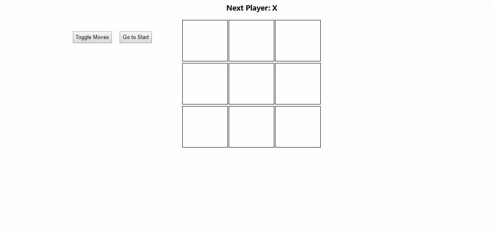

# ReactTicTacToeTutorial
Tic Tac Toe Xs and Os 

I'm following the React js online tutorial from facebook. But the important   
thing is I'm implementing all my solutions myself for this Tic-Tac-Toe problem.  

<h3>Technoligies I'm using for this project</h3>

<ul>
    <li>React js</li>
    <li>Css</li>
</ul>

<h3>A quick video of the final product:</h3>

